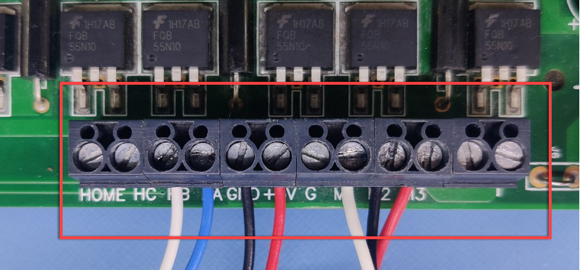
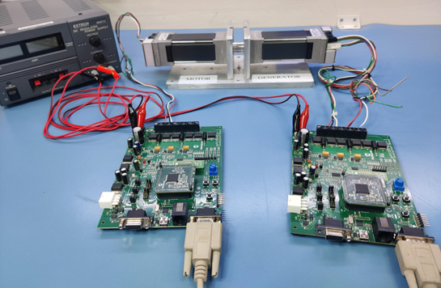
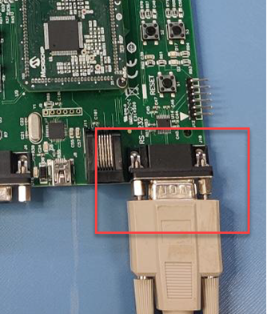

 

# MATLAB MCLV-2 dsPIC33CK256MP508 REGENERATIVE BRAKING 

## 1. INTRODUCTION

This document describes the setup requirements for running the Regenerative Braking algorithm, using MATLAB Simulink, MCLV-2 Development Board and dsPIC33CK256MP508 External Op-Amp Motor Control Plug-In Module (PIM).

## 2.	SUGGESTED DEMONSTRATION REQUIREMENTS
### 2.1 MATLAB Model Required for the Demonstration
-  MATLAB model can be cloned or downloaded as zip file from the Github repository ([link](https://github.com/microchip-pic-avr-solutions/matlab-mclv2-dspic33ck256mp508-regenerativebraking)).

### 2.2	Software Tools Used for Testing the MATLAB/Simulink Model
1.	MPLAB X IDE and IPE (v6.0)
2.	XC16 compiler (v2.00)
3.	MATLAB R2022a
4.	Required MATLAB add-on packages
    -	Simulink
    -	Simulink Coder
    -	Stateflow
    -	MATLAB Coder
    -	Embedded Coder (v7.8)
    -	MPLAB Device blocks for Simulink (v3.50.24)
    - Motor Control Blockset (v1.4)

> **_NOTE:_**
>The software used for testing the model during release is listed above. It is recommended to use the version listed above or later versions for building the model.

### 2.3	Hardware Tools Required for the Demonstration
- dsPICDEM™ MCLV-2 Development Board ([DM330021-2](https://www.microchip.com/en-us/development-tool/DM330021-2)) - (Quantity 2)
- dsPIC33CK256MP508 External Op-Amp Motor Control Plug-in module  ([MA330041-1](https://www.microchip.com/en-us/development-tool/MA330041-1)) - (Quantity 2) 
- Benchtop power supply (compactable with 24V, 5A).
- 24V, 3-Phase Brushless DC Permanent Magnet Hurst Motor ([AC300022](https://www.microchip.com/en-us/development-tool/AC300022)) - (Quantity 2, the motor shafts are couple together)

> **_NOTE:_**
>All items listed under this section Hardware Tools Required for the Demonstration are available at [microchip DIRECT](https://www.microchipdirect.com/).

  
## 3. HARDWARE SETUP

This section describes hardware setup required for the demonstration.

1. 
 Disconnect power to the dsPICDEM™ MCLV-2 Development Boards and set up the following jumpers on both the boards:

    

    

2. 
 Insert the ‘External Op Amp Configuration Matrix board’ into matrix board header J14 of both the boards. Ensure the matrix board is correctly oriented before proceeding.

    

    

3. 
 Insert the dsPIC33CK256MP508 External Op-Amp Motor Control PIM into the PIM Socket U9 provided on the dsPICDEM™ MCLV-2 Development Boards. Make sure the PIM is correctly placed and oriented before proceeding.

    

    

4. 
	Connect the three phase wires from the motor to M1, M2, and M3 terminals of connector J7, provided on the motor side dsPICDEM™ MCLV-2 Development Board. Please note that for sequence of 3 phase wires and the encoder wires sequence must be as shown below.

    

    

5. 
	Connect the three phase wires from the motor to M1, M2, and M3 terminals of connector J7, provided on the generator side dsPICDEM™ MCLV-2 Development Board. Please note that for sequence of 3 phase wires and the encoder wires sequence must be as shown below.

    

    

6. 
	Plug in the 24V power supply to connectors BP1 and BP2 provided on both the dsPICDEM™ MCLV-2 Development Boards (ensure that both the MCLV-2 boards are connected in parallel to the power supply).

7. 
	The Hurst 300 motors shafts should be coupled together, so that one will work as a motor and other will work as a generator.

8. 
	The final picture of the setup is shown below

    

    

9. 
	Connect the Microchip MPLAB PICkit 4 In-Circuit Debugger to the Connector J12 of the dsPICDEM™ MCLV-2 Development Board as shown below and to the Host PC used for programming the device. Ensure the arrows indicated on the board and  PICkit 4 orient as shown in the picture. 

    

    

> **_NOTE:_**
>It is recommended to use a right-angled pin header to use J12 for programming. A straight header mounted with PICkit 4 may result in mechanical stresses on the programmer con-nector or the development board in use.

  
	Alternatively, the programmer/debugger can be connected to J11 using a RJ-11 to ICSP adapter (AC164110).

  

  

## 4.	BASIC DEMONSTRATION

 Follow the below instructions step-by-step, to set up and run the motor control demo application:

1. Launch MATLAB (refer the section [“2.2 Sofware Tools Used for Testing the MATLAB/Simulink Model"](#22-software-tools-used-for-testing-the-matlabsimulink-model)).
 
2. Open the folder dowmloaded from the repository, in which MATLAB files are saved (refer the section ["2.1 MATLAB Model Required for the Demonstration"](#21-matlab-model-required-for-the-demonstration)).

    

    

3.	
 Connect the PICkit 4 In-Circuit Debugger to the Connector J12 of motor side MCLV-2 Development Board. 

4.	
 Double click and open the <b>dsPIC33CK256MP508_MCLV2_SMO_data.m</b> file. This file contains the configuration parameter for the motor and board. By default, the file is configured to run Hurst 300 motor and MCLV-2 board. Run the file by clicking the <b>“Run”</b> icon and wait till all variables get loaded on the <b>‘Workspace’</b> tab.

    

      

    

5.	
Double click on <b>dsPIC33CK256MP508_MCLV2_SMO_Motor.slx</b> Simulink model.

    

      

    

6.	
This opens the Simulink model, as shown below.  

    

      

    

7.	
From this Simulink model an MPLAB X project is generated, and it can be used to run the motor using MCLV-2 board. To generate the code from the Simulink model, go to the <b>“MICROCHIP”</b> tab, and enable the tabs shown in the figure below. 

    

      

    

8.	
	To generate the code and program the dsPIC33CK256MP508 device, click on <b>‘Build Model’ or ‘Clean Build Model’</b> option under the <b>“Microchip”</b> tab. This will generate the MPLAB X project from the Simulink model.

    

      

    

9.	
After completing the process, the <b>‘Operation Succeeded’</b> message will be displayed on the <b>‘Diagnostics Viewer’</b>.

    

      

    

10.	If the device is successfully programmed, <b>LED- LD10 and LD11</b> will be blinking.

11. 
Now connect the PICkit 4 In-Circuit Debugger to the Connector J12 of generator side MCLV-2 Development Board. 

12. To program the generator side dsPIC33CK256MP508 device repeat the step 4 to 10, using the <b>dsPIC33CK256MP508_MCLV2_Generator_data.m</b> and <b>dsPIC33CK256MP508_MCLV2_QEI_Generator.slx</b>  files.

13.	To run the setup, press the push button <b>S2</b>of the motor side MCLV-2 board first and then the generator side MCLV-2 board.

    

      
 
    

14.	The motor speed can be varied using the potentiometer (labeled <b>“POT1”</b>) of the motor side MCLV-2 board. The regenerative torque can be varied using the potentiometer (labeled <b>“POT1”</b>) of the generator side MCLV-2 board.

15.	Press the push button <b>S2</b> of the motor side and generator side MCLV-2 to stop the operation.

## 5.	DATA MONITORING USING MOTOR CONTROL BLOCKSET (MCB) HOST MODEL

The regenerative braking simulink models comes with the initialization required for data monitoring using Motor Control Blockset Host Model (MCB Host Model). The MCB Host Model is a Simulink model which facilitates data monitoring through the UART Serial Interface. 

1.	
To establish serial communication with the host PC, connect a USB to RS-232 cable between the host PC and the MCLV-2 Board (J10 connector) of both motor and generator side.
    

      

    

2. Ensure the sensorless FOC model is programmed and running as described under section ["4. Basic Demonstration"](#4-basic-demonstration) by following steps 1 through 14.

3. 
Open the MCB Host model (mcb_host_common.slx)

    

      

    

4.	
Double click on the  the <b>“Motor_Rx”</b> block. Then select the appropriate COM port which is connected to the motor side MCLV-2 board from the drop-down menu and set the baud rate as 115207. Please note that the same baud rate has been set in the motor side Simulink model (the baud rate can be viewed on the <b>“UART Configuration block”</b> in the <b>“Hardware Init”</b> subsystem).

    

      

    

5.	
Open the <b>“Motor_Rx”</b> subsystem to configure the COM port. This can be done by configuring the <b>“Host Serial Receive”</b> block of the <b>“Motor_Rx”</b> subsystem. Ensure to select the same COM port configured in step 4.
    

      

    

6. 
Similarly, double click on the <b>“Generator Serial Setup”</b> block. Then select the appropriate COM port which is connected to the genrator side MCLV-2 board from the drop-down menu and set the baud rate as 115207. Please note that the same baud rate has been set in the generator side Simulink model (the baud rate can be viewed on the <b>“UART Configuration block”</b> in the <b>“Hardware Init”</b> subsystem).
    

      

    

7. 
Open the <b>“Generator_Rx”</b> subsystem to configure the COM port. This can be done by configuring the <b>“Host Serial Receive”</b> block of the <b>“Generator_Rx”</b> subsystem. Ensure to se-lect the same COM port configured in step 6.

    

      

    

8. 
Click the run icon of the MCB Host model to open the scope window and monitor the signals.

    

      

    

9.	
Figure below shows an example of monitored signals using the MCB Host Model. 

    

      

    

## 	REFERENCES:
For more information, refer to the following documents or links.
1.	AN1078 Application Note “[Sensorless Field Oriented Control of a PMSM](https://www.microchip.com/en-us/application-notes/an1078)”.
2.	dsPICDEM™ MCLV-2 Development Board User’s Guide  ([DS52080A](https://ww1.microchip.com/downloads/en/DeviceDoc/DS-52080a.pdf)) 
3. dsPIC33CK256MP508 Motor Control Plug-In Module (PIM) Information Sheet for External Op Amp Configuration ([DS50002757A](http://ww1.microchip.com/downloads/en/DeviceDoc/dsPIC33CK256MP508-Motor-Control-PIM-for-External-Op-Amp-Configuration-DS50002757A.pdf))
4.	[MPLAB® X IDE installation](https://microchipdeveloper.com/mplabx:installation)
5.	[MPLAB® XC16 Compiler installation](https://microchipdeveloper.com/mplabx:installation)
6.  [Motor Control Blockset](https://in.mathworks.com/help/mcb/)
7.  [MPLAB Device Blocks for Simulink :dsPIC, PIC32 and SAM mcu](https://in.mathworks.com/matlabcentral/fileexchange/71892-mplab-device-blocks-for-simulink-dspic-pic32-and-sam-mcu)